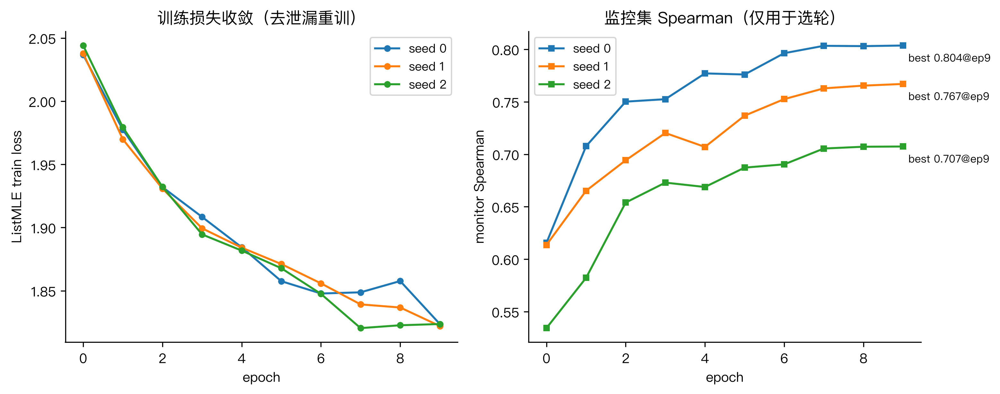
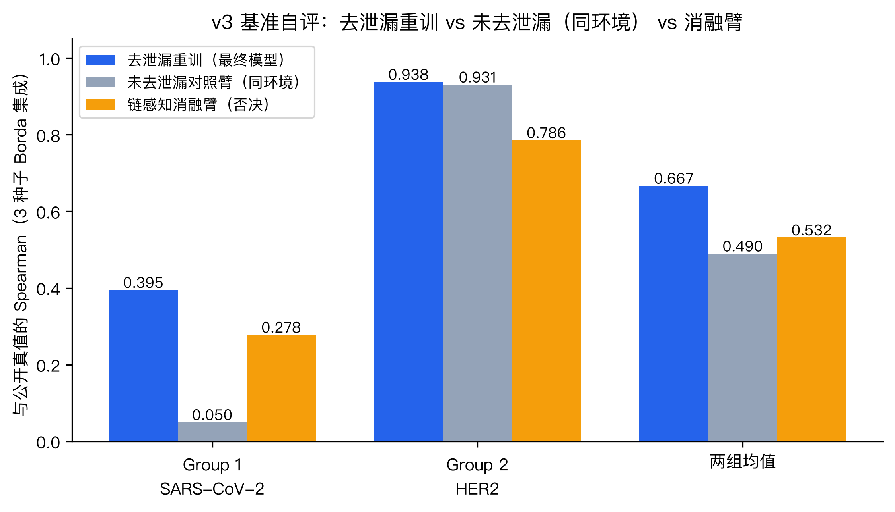

# 算法训练文档 —— 抗原-抗体亲和力排序模型

**日期**：2026-08-12

**配套文档**：《算法设计文档.md》（综述、架构与损失函数设计；文献编号 [n] 与其参考文献表共用）。本文档覆盖运行环境、数据处理、训练过程、消融实验历程、测试结果与计算性能。全部消融明细数据另汇总于附表 `docs/assets/附表A_消融实验汇总.xlsx`。

---

## 1. 运行环境

### 1.1 硬件

表 6 硬件环境

| 用途 | 配置 |
|---|---|
| 嵌入提取（一次性）+ 推理 | CPU 即可（无 GPU 依赖）；GPU 可加速 |
| 模型训练 | 云端 GPU 实例：RTX 4090 24GB ×1，16 vCPU（Xeon Platinum 8352V），120GB 内存，Ubuntu 22.04 |

### 1.2 软件依赖

表 7 核心软件依赖与版本

| 库 | 训练端（GPU） | 推理/提取端（CPU） |
|---|---|---|
| Python | 3.12 | 3.12（venv） |
| PyTorch | 2.8.0+cu128（CUDA 12.8） | 2.13.0+cpu |
| transformers | 5.14.1 | 5.14.1 |
| numpy / pandas / scipy | — | 2.5.1 / 3.0.3 / 1.18.0 |
| tokenizers / openpyxl | — | 0.22.2 / 3.1.5 |

安装：`pip install -r code/requirements.txt`（版本已固化）。预训练权重（开源，下载至 `code/model_data/`）：AntiBERTy（HuggingFace `zrollins/antiberty` 镜像，含 `vocab.txt`）、ESM-2 650M（`facebook/esm2_t33_650M_UR50D`）。

### 1.3 运行命令示例

```bash
# 一键训练：基准去泄漏扫描 -> 3 种子重训（含运行结果案例注释）
python code/train.py

# 一键推理：v3 评测集 -> 逐种子分数/排名 + Borda 集成 CSV
python code/inference.py
# 输出 code/predictions/mAbs_ranking.csv（40 行，2 组各为 1–20 排列）

# 一键产出最终文件：解析 v3 xlsx -> 集成推理 -> 产出组内排序
python code/predict.py
# 输出 final_predictions.xlsx（保留 v3 模板结构与格式）

# 单元冒烟测试（合成缓存 + 各消融臂 20 步）
python code/training/smoke_test.py
```

完整管线（如需从零重建语料/缓存）：`data_pipeline/01–07` → `extraction/extract_antiberty.py` + `extraction/extract_antigens.py` → `code/train.py`。

## 2. 数据处理

### 2.1 训练数据输入/输出格式

- **输入**：83 个公开数据集源 CSV（AbRank、kothiwal2025htp、SAbDab 衍生集等），字段各异。
- **管线输出**（`data_pipeline/output/`）：
  - `harmonized_clustered.csv.gz` — 641,454 行 / 5,697 抗原组；统一字段（`seq_heavy/seq_light/fitness/censored/rank_only/ab_cluster_raw/ag_cluster_raw/ag_seq` 等）；
  - `training_groups.csv` — 2,274 个合格训练组（权重 min(N,2000)）；
  - `splits.json` — LOFO 折、AbRank 聚类分层 5 折、抗原聚类留出折、跨文件泄漏标记；
  - `deleak_v3_exclude.json` — v3 基准去泄漏剔除清单（设计文档 §2.5）。
- **嵌入缓存**（fp16 npz，按 sha1 去重）：
  - `extraction/cache_antiberty/` — 235,331 条唯一抗体（VH+VL 逐链过 AntiBERTy，去特殊符后重→轻拼接，[L,512]，npz 内含 `len_heavy` 链边界）；
  - `extraction/cache_esm2/` — 4,716 条唯一抗原（[L,1280]；>1000 aa 滑窗 1000/500 重叠平均）；缺失抗原走零向量回退。

### 2.2 v3 评测集处理

v3 评测集 xlsx（mAbs 表）→ `data_pipeline/parse_v3_xlsx.py` 一键解析为 `data/benchmark_mAbs_v3.csv`（40 行：group, seq_id, antigen_name, antigen, VH, VL），解析内置断言：40 行、每组 20 条、(group, seq_id) 唯一、Group 2 VL 全同、全大写氨基酸字母表。v3 CSV 只由该脚本生成，保证可追溯。

- **Group 1**：SARS-CoV-2 全长刺突蛋白（1273 aa，全组共享，走滑窗路径）× 20 条 mAb；
- **Group 2**：HER2 胞外域（630 aa）× 20 条曲妥珠框架 CDR-H3 变体（VL 全部相同）。

推理时**每行抗体与其自身抗原配对打分**，与训练格式一致；组大小自适应（不写死 20/组），输出断言每组为 1–N 排列。

### 2.3 自有数据集说明

未使用私有数据；全部训练数据来自公开基准（设计文档 §2.2）。数据侧的贡献在于统一清洗（恒定区修剪、标签符号审计、截断值解析、聚类防泄漏）与 v3 基准去泄漏协议（设计文档 §2.5）。

## 3. 算法训练

### 3.1 训练过程

冻结双塔 → 嵌入缓存 → 仅训练适配器/交互/融合/头（1,860,737 参数）。每个训练步：按组权重采样一个组 → 组内取 ≤20 条列表（截断样本 ≤25%）→ 加载缓存嵌入 → 前向打分 → ListMLE 损失（并列扰动 + 截断钉底）→ AdamW 更新 [19]。

**最终模型（v3 去泄漏版）**：在去泄漏后的 579,829 条合格行上训练（= 579,930 − 101 剔除行；泄漏守卫另自动剔除跨文件重复 61,524 行），3 个随机种子，每种子保留 `best.pt`（监控集最优轮）与 `last.pt`。

### 3.2 超参数

表 8 超参数与确定依据

| 超参数 | 取值 | 确定依据 |
|---|---|---|
| 优化器 | AdamW [19]，β=(0.9,0.999)，wd 0.01（仅权重矩阵） | 计划基线 |
| 学习率 | 3e-4；融合/门控参数组 1e-3（无 wd） | 稳定化研究：1e-4 欠训（0.250），3e-4 保留（§4.2） |
| 步数/轮 | 1500（由 500 上调，+0.021 均值，4/5 折获胜） | 稳定化研究（3 种子 × 5 折，§4.2） |
| 轮数 / 早停 | 10 轮，耐心 3（按验证 Spearman，非损失） | — |
| 调度 | 余弦退火 + 5% warmup，梯度裁剪 1.0 | — |
| 列表大小 / 截断上限 | 20 / 25% | 评测格式 |
| rank_only 降权 | 0.5× | 消融 A4（代理标签毒化证据，§4.2） |
| λ_aux | 0.0（辅助 margin 损失关闭） | 消融 A4b：中性（§4.2） |
| 批次 | token 预算 65,536 | 显存/内存约束 |

### 3.3 收敛性分析

去泄漏重训 3 个种子（10 轮 × 1500 步）均完整跑满，收敛情况见表 9、图 3：

表 9 去泄漏重训收敛情况（3 种子）

| 种子 | 末轮训练损失 | 监控集 Spearman（最优轮） | 最优轮 |
|---|---|---|---|
| 0 | 1.824 | 0.804 | 9 |
| 1 | 1.822 | 0.767 | 9 |
| 2 | 1.824 | 0.707 | 9 |



图 3 训练损失与监控集 Spearman 随轮次曲线（去泄漏重训，3 种子）。损失平滑下降无发散；监控 Spearman 总体爬升、个别轮次小幅回落（监控集在训练集内，数值偏乐观，仅用于选轮）。种子间差异主要来自初始化轨迹噪声——这正是采用多种子集成的原因（§4.1）。

## 4. 算法测试与消融实验

### 4.1 评测协议

单折单种子的验证 Spearman 轮间摆动达 ±0.1，同一折同一种子在 CPU 与 GPU 初始化下相差 ~0.04——单次运行的数字不用于架构决策。因此确立两条协议：

1. **所有消融判定采用 3 种子 × 每种子取最优轮（mean-of-best）**，且对比臂与基线同批次、同配方训练，唯一差异即被消融的组件；
2. **最终推理采用 3 种子 Borda 集成**（组内逐种子排名取平均再排序），进一步抑制轨迹噪声。

另有两条工程约束：嵌入缓存经完整性扫描后方可用于训练（同一缓存同一时刻仅一个写入进程）；抗原聚类留出折 1–4 因验证组数偏斜（47–81 组 vs fold0 的 1,989 组）不具判别力，OOD 判定仅使用 fold0。

### 4.2 架构消融历程 A0–A4 与稳定化研究

以下为模型定型（v5 配方）的完整消融矩阵，协议：AbRank 聚类分层 5 折 + 抗原聚类留出 fold0，3 种子 mean-of-best（明细见附表 sheet 1）。

**A0 — 完整模型 vs 基线**（表 10）：

表 10 A0 消融：完整模型 vs 基线（AbRank 5 折均值）

| 基线 | AbRank 5 折均值 | 备注 |
|---|---|---|
| 线性探针（pooled 512+1280 → Linear） | 0.214 | fold0 崩塌至 0.068——无跨抗原迁移 |
| 零样本 IgLM / ProGen2 | ≈0 / 仅 kothiwal-DCC 0.322 | 地板线，与 FLAb 报告一致 [5] |
| **完整模型（交叉注意力+双线性门控）** | **0.276** | 较探针 +0.062，5 折中胜 4 折 |

**A1 — 抗体塔选型**：AntiBERTy 0.276 ± 0.064（fold0 0.083） vs IgLM 0.261 ± 0.059（fold0 0.058）。IgLM 的因果 LM 特征最不稳定（fold0 种子散布 0.094–0.257，三次 epoch-0 早停）。**AntiBERTy 入选** [1][3]。

**A2 — 交互方式**（表 11）：

表 11 A2 消融：交互方式对比（3 种子 mean-of-best）

| 臂 | AbRank 均值 | 抗原留出 fold0 |
|---|---|---|
| **交叉注意力（Q=抗原）** | **0.276 ± 0.064** | **0.083 ± 0.051** |
| 盲抗原对照（去掉抗原塔） | 0.256 ± 0.075 | 0.054 ± 0.026 |
| 仅拼接（无交互） | 0.242 ± 0.089 | 0.075 ± 0.015 |

交叉-盲抗原差距在 AbRank 上温和（+0.020），在最严格留出轴上接近翻倍（0.083 vs 0.054）；仅拼接在 0/1/3 折落败，交互模块保留。

**A3 — 融合方式**：双线性门控 ≥ 纯拼接（两个评估轴均值均占优），保留。

**A4 — 数据因子**：

- **rank_only 代理标签**：完全排除（factor=0）对 SPR-Kd 迁移是决定性的（DCC 折 0.039 → 0.350），但对 AbRank 式训练显著有害（−0.011 vs 0.276——AbRank 合格组大多是 rank-only）。**保留 0.5× 降权**作为折中；
- **λ_aux（VHH margin 辅助损失）**：0.263 vs 0.261，中性。**默认改为 0.0**，目标函数保持单一 ListMLE。

**稳定化研究（配方定型）**：针对轮间 ±0.1 摆动与 epoch-0 早停现象，AbRank 5 折 × 种子 {0,1}，结果见表 12：

表 12 稳定化研究：训练配方对比

| 配方 | 均值 ± sd |
|---|---|
| 基线（lr 3e-4，500 步/轮） | 0.276 ± 0.064 |
| lr 1e-4（融合 3e-4） | 0.250 ± 0.088 ——欠训，否决 |
| **1500 步/轮** | **0.297 ± 0.066 ——采纳**（4/5 折获胜，达预设 ±0.02 门槛） |

机制解读：更多更新步数降低了"首轮评估碰巧走好"的运气依赖。**`steps_per_epoch` 500 → 1500。**

**难边界**：所有臂在整族抗原未见（抗原聚类留出 fold0）时 Spearman 均 ≪0.1（最优 0.083）vs AbRank 聚类折的 0.28——模型学到的是抗原*特异*的结合上下文而非可迁移的抗原生物学。这决定了对未见抗原评测组的现实预期（§4.6 不足分析）。

### 4.3 输入侧消融

明细见设计文档 §2.6 与附表 sheet 2，结论摘要：

- **链感知接口（chain_ids）**：监控集 3/3 种子全劣（0.787/0.749/0.666 vs 0.804/0.766/0.700），v3 自评 0.532 vs 0.714。**否决**——可学习链型偏置破坏了冻结表征的既有几何；
- **链掩码探针**：仅 VH 输入保留大部分信号（Group 1 0.382 vs 完整 0.593；Group 2 0.833 vs 0.845），仅 VL 接近归零（Group 2 VL 无组内变异，符合设计）。双链互补、VL 信息已被有效利用，**混合编码器塔备选臂不启动**。

### 4.4 结构模态第三塔消融

明细见设计文档 §2.7 与附表 sheet 3。摘要：ProstT5 池化残差 −0.004、SaProt 池化残差 +0.001、SaProt 池化交叉注意力 −0.013、SaProt 逐残基门控塔内融合 −0.001（均 vs 同协议基线 0.7569，3 种子 mean-of-best）；OOD 补充（ProstT5 臂，fold0）+0.021 未达采纳门槛。**结构第三塔路线整体证伪，不进入最终管线**；负结果的信息视角解读见设计文档 §2.7。

工程注记：SaProt 逐残基缓存为 235,331 条抗体全量提取（IgFold 折叠 → foldseek 3Di → SaProt-650M 前向，约 24 小时，0 失败）；真实结构预检（Arm 0）显示抗体侧 SAbDab 精确覆盖率仅 0.22%，证实"收集现有真实结构"不可行。

### 4.5 v3 评测集结果

最终结果文件由 `predict.py` 产出：解析 v3 xlsx → 3 种子去泄漏检查点 Borda 集成 → 产出组内排序（每组 1–20 排列，已校验）。利用基准的公开真值（Kd）做**独立自评**（仅校验）：



图 4 v3 基准独立自评：去泄漏重训（最终模型）vs 未去泄漏对照臂 vs 链感知消融臂（3 种子 Borda 集成，与公开 −log Kd 的组内 Spearman）。

表 13 v3 评测集自评结果（与公开真值的组内 Spearman）

| 模型 | Group 1（SARS-CoV-2） | Group 2（HER2） | 均值 |
|---|---|---|---|
| **去泄漏重训（最终模型，3 种子集成）** | **0.395** | 0.938 | **0.667** |
| 未去泄漏对照臂（同环境复训，仅对照） | 0.050 | 0.931 | 0.490 |
| 链感知消融臂（否决，见 §4.3） | 0.278 | 0.786 | 0.532 |

逐种子明细（去泄漏模型，分数与公开 −log Kd 的 Spearman）：Group 1 = 0.287 / 0.304 / 0.155，Group 2 = 0.750 / 0.874 / 0.910——Group 2 三种子一致且集成后升到 0.938，Group 1 种子间离散较大（明细见附表 sheet 4）。

对照解读（去泄漏 vs 未去泄漏，同语料/同缓存/同配方，唯一差异为 101 行剔除）：未去泄漏臂在 Group 2 上 0.931 ≈ 去泄漏臂 0.938——该组本就有同框架真实 Kd 训练信号，剔除基准行几乎不损失泛化能力；Group 1 上未去泄漏臂反而降至 0.050（逐种子 0.072 / −0.069 / 0.000）——见过基准精确标签并未转化为组内排序能力。两臂均值 0.667 vs 0.490。（历史对照：首轮旧实例上两臂分别为 0.585/0.842/0.714 与 0.457/0.953/0.705；Group 1 跨环境波动达 0.05–0.59，该组评估噪声较大，见 §4.6。）

### 4.6 优势与不足

- **优势**：抗原条件化带来的跨抗原泛化（多样抗原折 +0.2 以上）；可训练参数量小（186 万），训练快、抗过拟合；针对截断/代理标签数据的损失修正；抗原缺失时退化为仅抗体路径；基准解析、去泄漏、训练、推理、回填各环节均脚本化、可复现审计；结构模态经四形态消融确认无增量后未纳入最终模型（§4.4）。
- **不足**：整族抗原未见时（抗原聚类留出）Spearman 仅 ~0.08，模型学到的是抗原特异的结合上下文而非可迁移的抗原生物学；Group 1（全长刺突、中和表位多样）排序置信度中等，种子间方差大；逐行抗原依赖提供抗原序列，缺失时退化为抗体先验。

## 5. 计算性能

表 14 各阶段资源消耗与耗时

| 阶段 | 资源 | 耗时/开销 |
|---|---|---|
| 抗体嵌入提取（235,331 条，一次性） | RTX 4090（GPU 版脚本，~640 条/s） | 48 GB fp16 缓存，**约 6 分钟** |
| 抗原嵌入提取（4,716 条，一次性） | 同上（~51 条/s） | 4.9 GB fp16 缓存，平均 ~430 aa/条，11 条滑窗，**约 2 分钟** |
| 训练（单种子 10 轮 × 1500 步，RTX 4090） | 显存 ~3.5 GB，RAM ~3.3 GB | 25–51 s/轮，**全程 4.5–8.5 分钟** |
| 去泄漏重训（3 种子合计） | 同上 | **约 18 分钟**（缓存复用，仅训头部） |
| 推理（40 抗体 + 2 抗原 + 3 检查点） | CPU <4 GB RAM / GPU | 分钟级（嵌入提取 + 打分 + 回填） |

（附）结构消融臂的额外一次性成本（不进最终管线）：SaProt 逐残基提取约 24 CPU/GPU 小时（127 GB 缓存）、池化版约 27 小时；每消融臂训练约 35 GPU 分钟（3 种子）。

瓶颈算子：训练期为嵌入 npz 的随机读取与 padding 批次的前向（256 维小矩阵乘，主要受 CPU 数据供给限制，GPU 利用率 ~47%）；推理期为 ESM-2 650M 的前向（650M 参数，CPU 上单条约秒级，全长刺突滑窗 ×3）。因双塔冻结且结果缓存，端到端成本集中在一次性提取阶段；训练/推理本身均为分钟级。

---

## 附：复现说明

发布包结构见报告总览（"发布包结构与内容分布"）。

预训练双塔为开源模型（AntiBERTy / ESM-2 650M），全程冻结未微调；自训练部分为适配器/交互/融合/打分头（1,860,737 参数）。选择冻结的理由与证据见设计文档 §1.3；头部自训练满足"自训练模型"认定（最终模型版本收录于 `code/training/runs/`）。
