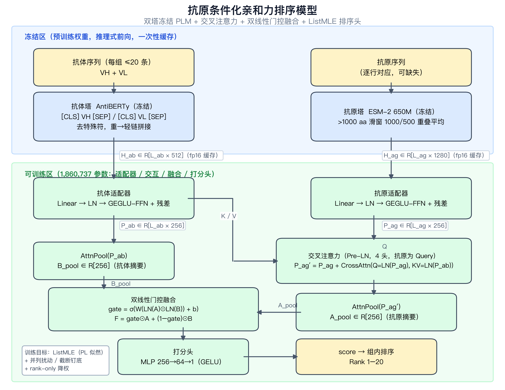
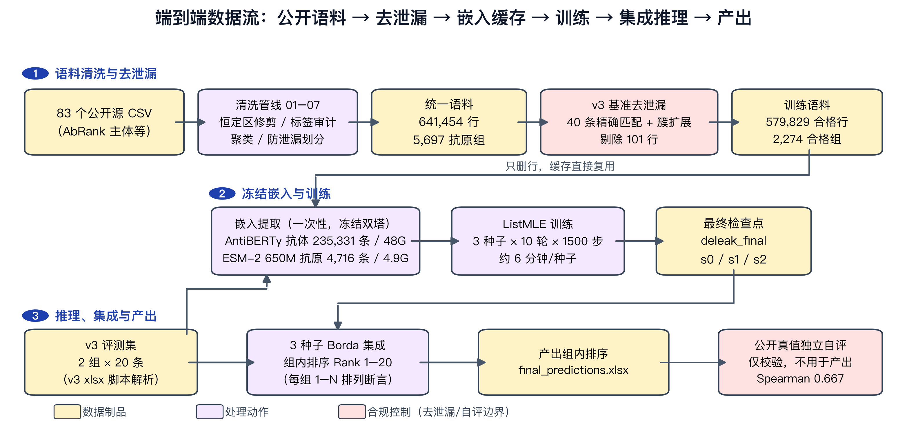

# 算法设计文档 —— 抗原-抗体亲和力排序模型（抗原条件化双塔冻结编码器 + 交叉注意力 + 列表排序学习）

**日期**：2026-08-12

**任务**：对标准数据集中的抗原-抗体对进行亲和力评估，输出每组 20 条抗体的亲和力排序（评测指标：每组预测排序与真实排序的 Spearman 相关系数）。

**配套文档**：《算法训练文档.md》（运行环境、数据处理、训练过程、消融历程与测试分析）。

---

## 1. 算法综述

### 1.1 国内外研究现状

抗体-抗原亲和力预测的主流技术路线可分为四类：

1. **零样本蛋白质语言模型（PLM）打分**。ESM-2 [2]、IgLM [3]、ProGen2 [4] 等模型的伪似然/困惑度可直接作为序列适应度代理。但公开基准评测表明，结合亲和力是一种"外在属性"（extrinsic property，依赖于抗原上下文），零样本打分在该任务上很弱：FLAb 基准中所有零样本模型在亲和力数据集上的相关性普遍接近 0 [5]；其扩展版 FLAb2 覆盖 30 个模型，最佳模型的平均排序相关也仅 ρ≈0.12，且 PLM 打分存在显著的 germline 偏置（控制 germline 距离后表观预测力平均损失约 40%）[6]。零样本打分只能作为基线，不能作为方案。
2. **监督式 PLM 嵌入探针与微调**。AbAffinity 的骨干消融表明，冻结 ESM-2 嵌入 + 轻量预测头是序列骨干中的最强配置，其完整模型在随机划分下达到 Pearson 0.86 / Spearman 0.84 [7]；FLAb2 的少样本实验进一步表明，在 embedding 微调设定下**通用蛋白 LM 嵌入不劣于（甚至优于）抗体专用嵌入** [6]。这支持"冻结大规模 PLM + 轻量可训练头"的参数高效路线。
3. **排序学习（Learning-to-Rank）**。亲和力数据天然是"同一抗原组内可比、跨组不可比"的偏序数据。列表级排序损失 ListMLE 源于排序学习经典工作 [10]；在抗体亲和力任务上，AbLWR 的消融显示将 ListMLE 换为 MSE 回归后 FRA 指标从 21.28% 崩塌至 3.29% [8]；AbRank 基准则以成对 margin 排序损失（pairwise margin ranking）构建其基线框架 [9]。**排序损失显著优于回归损失**是该领域的共识。
4. **生成式与结构感知路线**。MAGE 用微调语言模型生成抗原特异性配对链抗体并经实验验证 [11]；RFdiffusion 面向结构层面的结合体从头设计 [12]；IgFold 实现秒级抗体结构预测 [23]；SaProt [21]、ESM-IF [24]、ESM3 [25] 等结构感知 PLM 将三维结构信息引入序列建模。这些工作面向"设计/生成"任务或通用表征学习，与本任务"给定抗体集合的亲和力排序"目标不同，列为相邻方向；其中结构感知路线对本任务的适用性，我们以消融实验直接检验（§2.7）。

双塔冻结编码 + 注意力交互的架构在分子相互作用预测中亦有充分先例：MolTrans（药物-靶点，双通道编码 + cross-view 交互注意力）[13]、AttABseq（抗体-抗原突变亲和力变化，注意力机制）[14]、DG-Affinity（PLM 嵌入回归亲和力）[15]、AbAgIPA（结构感知不变点注意力）[16]。

### 1.2 SOTA 算法技术特点

表 1 SOTA 算法技术特点与对本任务的适用边界

| 方法 | 类型 | 技术特点 | 对本任务的适用边界 |
|---|---|---|---|
| AbAffinity [7] | 序列-only 监督预测 | 冻结 ESM-2 650M 三流嵌入 + CDR 聚焦池化 + 门控交叉注意力，回归 pKd | 证明了冻结 ESM-2 骨干 + 轻量头的有效性；但回归目标与随机划分不直接对应组内排序评测 |
| AbLWR [8] | 列表排序学习 | ListMLE + PU 学习 + 同源抗原采样，列表内样本关系建模 | 与本任务目标最吻合（组内排序）；其消融提供了"排序损失不可替代"的直接证据 |
| AbRank / WALLE-Affinity [9] | 排序基准 + 基线 | 38 万条结合测定重构为成对排序，GNN + PLM 嵌入 + 结构，OOD 划分 | 提供了严格的去泄漏评估思想；成对 margin 损失是列表损失的替代方案 |
| MAGE [11] | 生成式设计 | 微调 PLM 直接生成抗原特异性 VH+VL 配对序列，实验验证 | 面向生成而非排序评测，是后续方向的相邻技术 |
| FLAb/FLAb2 零样本模型群 [5][6] | 无训练基线 | 各类 PLM 伪似然直接打分 | 证明零样本路线不可用，同时提供了评测协议与偏置分析范式 |

### 1.3 本算法的设计思想与先进性

**核心洞察：结合是"外在属性"（extrinsic property）——离开抗原谈抗体亲和力没有意义** [5]。仅编码抗体的模型只能学到"每组抗体的质量先验"，无法跨抗原泛化。因此本算法将抗原序列与抗体共同作为一等输入，构建**抗原条件化（antigen-conditioned）**的排序模型。

**为什么选择冻结 PLM 作为双塔（设计初衷）**，三条理由：

1. **表征充分性的公开证据**：大规模 PLM 的序列表征已包含丰富的结构与功能信息——FLAb2 在少样本 embedding 设定下证明通用蛋白 LM 嵌入不劣于抗体专用嵌入 [6]；AbAffinity 证明冻结 ESM-2 骨干即可支撑 SOTA 级亲和力预测 [7]。无需微调即可获得高质量表征。
2. **数据规模约束**：本任务合格训练组为 2,274 个（每组 ≤20 条），在此数据量上微调 6.5 亿参数的编码器必然过拟合并破坏预训练表征的几何结构；冻结 + 186 万参数轻量头是参数高效且抗过拟合的选择（经消融验证，见 §2.3 与训练文档 §4）。
3. **时间与算力约束**：开发周期内，"嵌入一次性提取落盘 + 仅训练轻量头"使单次训练压缩到分钟级，从而支撑了 3 种子 × 多评估轴 × 十余个消融臂的完整实验迭代（训练文档 §4）；微调路线在同等预算下无法完成这种严谨度的验证。

**架构要点**：

- **双塔冻结编码器**：抗体塔 AntiBERTy（约 26M 参数 [1]，512 维，在 5.58 亿条 OAS 抗体序列上训练的 MLM 双向编码器）；抗原塔 ESM-2 650M（1280 维 [2]，通用蛋白覆盖，可处理任意病毒糖蛋白/多肽抗原）。两塔完全冻结，嵌入一次性提取并落盘缓存，**可训练参数仅 186 万**。
- **抗原作为查询的交叉注意力**：让抗原残基主动"检索"抗体的互补决定区（CDR），符合结合界面的生物学直觉；消融证明该交互模块在多样抗原评测上不可替代（训练文档 §4.2）。
- **双线性门控融合**：门控单元自适应平衡"被抗体上下文调制后的抗原表征"与"原始抗体表征"（门控思想受 AlphaFold2 Evoformer 门控机制启发 [20]），抗原缺失时模型退化为仅抗体路径。
- **ListMLE 列表排序损失**：直接优化评测指标（组内排序）对应的 Plackett-Luce 似然 [10]，并针对真实亲和力数据特性做了三项修正（§2.4）。

**相对开源基线的改进点**：相比零样本 IgLM/ProGen2（ρ≈0，与 FLAb 报告一致 [5]），交叉验证 Spearman 提升至 0.30；相比线性探针（pooled 嵌入 + Linear，0.214，且在多样抗原折上崩塌至 0.068），完整交互架构取得 0.276–0.297，**在抗原多样性高的折上优势最大**（+0.21），表明抗原条件化的收益主要体现在泛化评估轴上（明细见训练文档 §4.2）。

---

## 2. 算法设计

### 2.1 算法架构与数据流

图 1 模型架构：双塔冻结 PLM（抗体塔 AntiBERTy + 抗原塔 ESM-2 650M）+ 可训练适配器/交叉注意力/双线性门控融合/打分头（共 1,860,737 可训练参数）。

图 2 端到端数据流：83 个公开源 CSV → 清洗管线 → 统一语料 → v3 基准去泄漏 → 冻结嵌入缓存 → ListMLE 训练（3 种子）→ Borda 集成 → 产出组内排序；公开真值仅用于独立自评，不进入产出链路（矢量图源文件见 `docs/assets/fig_dataflow.svg`）。

训练：每组采样 ≤20 条列表 → ListMLE 损失 → AdamW [19]。推理：逐行（抗体, 抗原）打分 → 按分数降序输出组内 Rank 1–20。

### 2.2 训练数据集构成

主语料来自公开亲和力数据集的统一清洗管线（`data_pipeline/`，83 个源 CSV → 641,454 行 / 5,697 个抗原组），构成见表 2：

表 2 训练数据集构成

| 组成 | 规模 | 说明 |
|---|---|---|
| AbRank 基准集 | 主体 | 中和/逃逸/IC50 等组内排序数据，恒定区已修剪，标签符号审计 |
| kothiwal2025htp | 364 行 / 9 组 | SPR Kd 实测，逐行抗原序列 |
| 其他公开集（SAbDab 等） | 52 组 | 统一协调（harmonize）后并入 |
| 辅助 binder/non-binder 对 | tsuruta / kirby | 消融后未采用（λ_aux=0，训练文档 §4.2） |

数据清洗关键步骤：恒定区修剪、亲和力标签符号审计、`Aff_op` 截断值（censoring，如 ">100 nM"）解析、仅排序（rank-only）组标记、CDR-H3 聚类与抗原聚类。合格训练组 2,274 个（组内 ≥20 条非截断记录），组权重 min(N, 2000)。

**抗原覆盖**：5,645/5,697 组由管线提供抗原序列，另手工策展 55 条（SAbDab-PDB 优先），共 4,716 条唯一抗原序列；仅 20 组抗原不可解析（走"空抗原"零向量回退路径）。

**防泄漏划分**：留一文件出（LOFO）、AbRank 抗体聚类分层 5 折、抗原聚类留出（整族抗原未见）三重评估轴；跨文件 CDR-H3 重复自动联合留出；随机划分禁用。v3 基准去泄漏见 §2.5。

### 2.3 模型配置

表 3 模型配置与选型依据（文献编号见参考文献；消融编号见训练文档 §4.2）

| 组件 | 配置 | 依据 |
|---|---|---|
| 抗体塔 | AntiBERTy（冻结，缓存）[1] | 消融 A1：优于 IgLM [3]（0.276 vs 0.261，且更稳定） |
| 抗原塔 | ESM-2 650M（冻结，缓存）[2] | 消融 A2 盲抗原对照；FLAb2 少样本证据 [6] |
| 适配器 | Linear→LN→GEGLU-FFN+残差，256 维 | GEGLU [17]；隐藏层用 softmax/sigmoid 是信息瓶颈（文献共识） |
| 交互 | Pre-LN 交叉注意力，Q=抗原 | 消融 A2：0.276 vs 盲抗原 0.256 vs 仅拼接 0.242；先例 [13][14][16] |
| 融合 | 双线性门控 | 消融 A3：≥ 纯拼接；门控机制 [20] |
| 损失 | ListMLE [10] + 三项修正 | 消融 A4 + 文献 [8][9]（§2.4） |
| 可训练参数 | 1,860,737 | 全部位于适配器/交互/融合/头 |

### 2.4 损失函数设计

**ListMLE（Plackett-Luce 负对数似然）** [10]，针对真实亲和力数据的三项修正：

1. **并列扰动（tie-jitter）**：相同亲和力值在目标序中加微扰，避免任意 tie-breaking 引入的伪序。
2. **截断值钉底（censored pinned）**：">阈值"类截断记录固定排在列表底部，且每个列表截断样本 ≤25%，防止 censored 数据主导梯度。
3. **仅排序组降权（rank_only 0.5×）**：Pred_affinity 等代理标签组按 0.5× 采样降权（消融 A4 证实代理标签会毒化 SPR-Kd 迁移，DCC 折 0.039→0.350，训练文档 §4.2）。

辅助 VHH margin 损失经消融为中性（0.263 vs 0.261），最终 λ_aux=0，目标函数保持单一 ListMLE。

### 2.5 基准去泄漏

**事实**：v3 评测集 40 条抗体全部来自公开数据集（FLAb/AbRank 体系），其精确序列与 Kd 可在公开渠道核到（对照表：`flab_reference/benchmark_v3_public_groundtruth.csv`）。原任务说明将 FLAb 数据指定为训练数据来源（AbRank 即其 `data/binding` 组成部分），因此**用 AbRank 训练本身完全合规**；但基准答案天然存在于训练分布中——若不处理，任何模型都可能以"记忆"替代"泛化"，复算时也无法区分两者。

**做法**：用同一配方训练"剔除 / 未剔除"两臂，直接观察模型在未见答案时的真实泛化能力（对照结果见训练文档 §4.5）。

**去泄漏方法**（`data_pipeline/08_deleak_v3.py`，全自动可追溯）：

1. 对 40 条基准抗体做 (VH, VL) 精确匹配，命中 **40/40**（共 64 个语料行）；
2. 按 CDR-H3 聚类（`ab_cluster_raw`）做**同簇扩展剔除**，无簇归属的命中行按行剔除：合计剔除 39 簇 + 16 行孤儿 = **101 行**（全部带亲和力标签；来源：AbRank 85 行、rawat2022abcov_kd 7 行、shanehsazzadeh2023 三文件 8 行），剔除清单落盘 `deleak_v3_hits.csv`；
3. 剔除在训练加载时生效（`exclude_json` 配置项），语料文件本体不动，可随时审计/回滚；未剔除对照臂仅需去掉该配置项复训（同环境已复现，见训练文档 §4.5）；
4. 嵌入缓存只含序列→向量映射，删行不影响缓存有效性，直接复用，仅重训 186 万参数头部。

### 2.6 输入侧架构决策记录

v3 重建时对输入接口做了两个候选方向的系统验证，结论：**维持扁平拼接接口 + AntiBERTy/ESM-2 双塔**（详细数据见训练文档 §4.3 与附表 xlsx）。

**候选一：显式链感知接口（chain_ids）**。背景：数据层全程保留 VH/VL 分列与链长，但模型接口把两条链拼接为一条扁平序列，无显式链边界。消融臂实现：collate 生成 `chain_ids [B,L]`（0=VH，1=VL），叠加 chain-type embedding 到适配器输入。结果：

- 监控集 Spearman 逐种子对比：0.787/0.749/0.666 vs 基线 0.804/0.766/0.700，**3/3 种子全劣**；
- v3 公开真值自评（集成）：**0.532** vs 基线 **0.714**（Group 1：0.278 vs 0.585；Group 2：0.786 vs 0.842）。

判读：对冻结 PLM 表征强行叠加可学习的链型偏置，破坏了预训练表征的既有几何，新参数在小数据上引入噪声。**链感知臂否决。**

**候选二：混合编码器塔（条件触发）**。触发判据：仅 VH / 仅 VL 输入的得分退化对比（`training/probe_chains.py`，对最终模型做掩码探针），结果见表 4：

表 4 链掩码探针：仅 VH / 仅 VL 输入的得分退化（与公开真值的 Spearman）

| 输入变体 | Group 1（双链均变异） | Group 2（VL 全同） |
|---|---|---|
| 完整输入 | 0.593 | 0.845 |
| 仅 VH | 0.382 | 0.833 |
| 仅 VL | 0.075 | ≈0（常数） |

判读：VH 承载主导排序信号（Group 2 VL 无组内变异，仅 VL 自然归零，符合设计）；Group 1 上 VL 掩码损失 −0.52、VH 掩码损失 −0.21，**双链互补且 VL 信息已被模型有效利用**——分析未指向 AntiBERTy 对某条链的表征不足，混合塔（AntiBERTy+ESM-2 混编等）备选臂**不启动**。

### 2.7 结构模态第三塔消融

**动机**：结构感知预训练模型（SaProt [21]、ESM-IF [24]、ESM3 [25] 等）在若干功能预测任务上报告了增益，且结构信息与序列信息在表征层面上属于不同视角。本节检验：在双塔之外注入结构嵌入（第三塔）能否为本排序任务带来增量。

**共同协议**：与最终模型同语料（v3 去泄漏后）、同配方（10 轮 × 1500 步、3 种子、监控集 100 组取 best Spearman），仅新增结构支路；结构特征全部离线提取并落盘缓存，可训练部分仍仅为轻量连接层，与基线的唯一差异即结构输入。

**真实结构可行性预检（Arm 0）**：配套的 SAbDab 结构数据中，抗原侧 25 条唯一序列 23 条精确命中，但**抗体侧真实结构覆盖率仅 0.22%**（314/144,140 唯一 VH 精确匹配）——"收集现有真实结构"路线在抗体侧不可行，以下各臂结构特征均来自预测结构（IgFold [23] 折叠 → foldseek 3Di 结构词表）。

四种融合形态：池化向量经 Linear 残差注入塔摘要向量（残差臂）、池化向量重塑为 8 个 struct token 后由塔摘要作 Query 交叉注意力（交叉注意力臂）、逐残基特征在抗体塔 FFN 之前以零初始化门控残差注入（逐残基门控臂，ReZero 式 [18]，训练起点严格等于基线）。消融结果见表 5（注入位置与实现明细见附表 xlsx sheet 3）：

表 5 结构模态第三塔消融结果（监控集 best Spearman，3 种子）

| 臂 | 结构编码器 | 融合粒度 | s0 | s1 | s2 | 均值 | Δ vs 基线 |
|---|---|---|---|---|---|---|---|
| **基线** | — | — | 0.8042 | 0.7663 | 0.7003 | **0.7569** | — |
| ProstT5 残差 | ProstT5 [22] | 池化 | 0.7983 | 0.7595 | 0.7005 | 0.7528 | −0.004 |
| SaProt 残差 | IgFold + SaProt-650M [21][23] | 池化 | 0.8042 | 0.7661 | 0.7025 | 0.7576 | +0.001 |
| SaProt 交叉注意力 | 同上 | 池化 | 0.7947 | 0.7387 | 0.6972 | 0.7435 | −0.013 |
| SaProt 逐残基门控 | 同上 | 逐残基 | 0.8012 | 0.7710 | 0.6957 | 0.7560 | −0.001 |

补充 OOD 证据（ProstT5 臂，AbRank fold0 抗原聚类留出）：0.2727 vs 基线 0.2513，+0.021 未达预设 +0.03 采纳门槛，且在种子噪声（基线逐种子散布 0.046）之内。

> 注：本表基线为与各消融臂同批次的 deleak_final 快照；最终检查点为同配方复训为同配方复训（训练文档 §3.3：0.804/0.767/0.707），与快照的差异属 GPU 非确定性噪声，不影响消融判定（各臂 Δ 均 ≤ 噪声量级或为显著负值）。

**判读**：

- 四种形态覆盖了**两条独立结构编码路径**（免结构预测的 ProstT5 [22] vs 显式 IgFold 结构 + SaProt [21][23]）与**三种注入方式**（池化残差 / 池化交叉注意力 / 逐残基门控塔内融合），结果全部落在种子噪声内或显著为负；
- 逐残基门控臂是对"注入点/粒度"假设的最强检验：结构信息在抗体 token 与抗原交叉注意力交互**之前**逐残基融入，且零初始化门控 [18] 保证不扰动基线起点——仍为零增益，说明瓶颈不在融合方式；
- 训练动态佐证：残差臂逐 epoch 曲线与基线几乎重合，模型学到的近乎恒等映射，结构支路贡献趋零。

**负结果的解读（信息视角的假设）**：回顾候选结构编码路径可以发现，**它们的输入在信息论意义上仍以序列为唯一来源**——IgFold 的三维结构本身就是从序列预测得来的派生产物，3Di 结构词表与 SaProt 的"结构感知"嵌入是对这一派生产物的再编码，整条链路上并没有引入任何序列之外的新信息。而本任务的评测目标是**同一抗原/同一抗体框架内细微亲和力差异的组内排序**：这类信号主要由 CDR  loop 的氨基酸组成与相互作用决定，序列嵌入（AntiBERTy/ESM-2）在此已接近饱和；结构通路所能提供的仅是折叠家族层级的粗粒度先验——对高度同源的组内变体而言近乎常量，构成**冗余甚至无信息的表征**。零初始化门控臂中模型学到近乎恒等映射，正是这一解读的机制层面印证。换言之，负结果的原因不是"结构信息无用"，而是**在当前链路下结构模态不包含序列之外的增量信息**；真正的实验测定结构（或端到端结构微调）是否不同，留待后续工作验证。

---

## 参考文献

[1] Ruffolo J A, Gray J J, Sulam J. Deciphering antibody affinity maturation with language models and weakly supervised learning. arXiv:2112.07782, 2021（NeurIPS 2021 MLSB Workshop）.
[2] Lin Z, Akin H, Rao R, et al. Evolutionary-scale prediction of atomic-level protein structure with a language model. Science, 2023, 379(6637): 1123-1130.
[3] Shuai R W, Ruffolo J A, Gray J J. IgLM: Infilling language modeling for antibody sequence design. Cell Systems, 2023, 14(11): 979-989.
[4] Nijkamp E, Ruffolo J A, Weinstein E N, et al. ProGen2: Exploring the boundaries of protein language models. Cell Systems, 2023, 14(11): 968-978.
[5] Chungyoun M, Ruffolo J A, Gray J J. FLAb: Benchmarking deep learning methods for antibody fitness prediction. bioRxiv, 2024. DOI: 10.1101/2024.01.13.575504.
[6] Chungyoun M, Gray J J. Fitness Landscape for Antibodies 2: Benchmarking reveals that protein AI models cannot yet consistently predict developability properties. bioRxiv, 2025. PMID: 41497662.
[7] Singh H, Malhotra A, Srivastava S P, et al. Antibody-antigen affinity prediction with chain-aware protein language modeling (AbAffinity). bioRxiv, 2026. DOI: 10.64898/2026.06.19.733375.
[8] Xu F, Huang Z A, He H, et al. AbLWR: A context-aware listwise ranking framework for antibody-antigen binding affinity prediction via positive-unlabeled learning. arXiv:2604.11272, 2026.
[9] Liu C, Pelissier A, Shao Y, et al. AbRank: A benchmark dataset and metric-learning framework for antibody-antigen affinity ranking. arXiv:2506.17857, 2025.
[10] Xia F, Liu T Y, Wang J, et al. Listwise approach to learning to rank: theory and algorithm. Proceedings of ICML, 2008: 1192-1199.
[11] Wasdin P T, Johnson N V, Janke A K, et al. Generation of antigen-specific paired-chain antibodies using large language models (MAGE). Cell, 2025, 188(25): 7206-7221.
[12] Watson J L, Juergens D, Bennett N R, et al. De novo design of protein structure and function with RFdiffusion. Nature, 2023, 620(7976): 1089-1100.
[13] Huang K, Xiao C, Glass L M, Sun J. MolTrans: Molecular interaction transformer for drug-target interaction prediction. Bioinformatics, 2021, 37(6): 830-836.
[14] Jin R, Ye Q, Wang J, et al. AttABseq: An attention-based deep learning prediction method for antigen-antibody binding affinity changes based on protein sequences. Briefings in Bioinformatics, 2024, 25(4): bbae304.
[15] Yuan Y, Chen Q, Mao J, et al. DG-Affinity: Predicting antigen-antibody affinity with language models from sequences. BMC Bioinformatics, 2023, 24: 430.
[16] Gu M, Yang W, Liu M. Prediction of antibody-antigen interaction based on backbone aware with invariant point attention (AbAgIPA). BMC Bioinformatics, 2024, 25: 348.
[17] Shazeer N. GLU variants improve transformer. arXiv:2002.05202, 2020.
[18] Bachlechner T, Majumder B P, Mao H, et al. ReZero is all you need: Fast convergence at large depth. Proceedings of UAI (PMLR 161), 2021.
[19] Loshchilov I, Hutter F. Decoupled weight decay regularization. ICLR, 2019.
[20] Jumper J, Evans R, Pritzel A, et al. Highly accurate protein structure prediction with AlphaFold. Nature, 2021, 596(7873): 583-589.
[21] Su J, Han C, Zhou Y, et al. SaProt: Protein language modeling with structure-aware vocabulary. ICLR, 2024.
[22] Heinzinger M, Weissenow K, Sanchez J G, et al. Bilingual language model for protein sequence and structure (ProstT5). NAR Genomics and Bioinformatics, 2024, 6(4): lqae150.
[23] Ruffolo J A, Chu L S, Mahajan S P, et al. Fast, accurate antibody structure prediction from deep learning on massive set of natural antibodies (IgFold). Nature Communications, 2023, 14: 2389.
[24] Hsu C, Verkuil R, Liu J, et al. Learning inverse folding from millions of predicted structures (ESM-IF). Proceedings of ICML (PMLR 162), 2022: 8946-8970.
[25] Hayes T, Rao R, Akin H, et al. Simulating 500 million years of evolution with a language model (ESM3). Science, 2025, 387(6736): 850-858.
